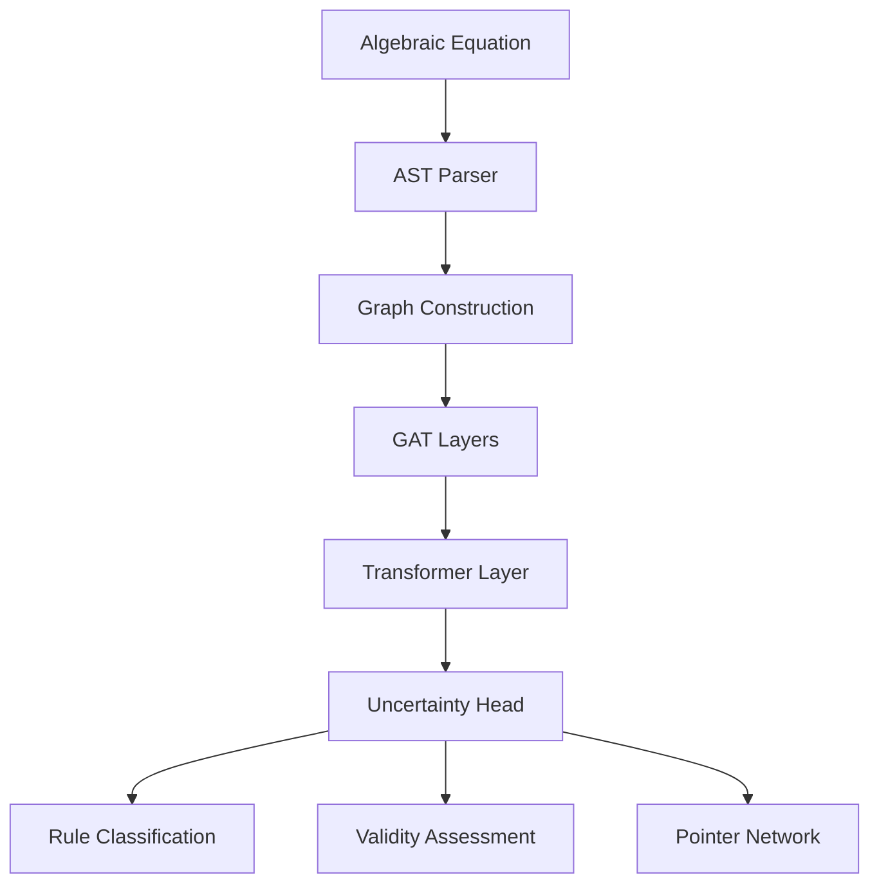

# Graph Neural Tutor for Rule-Aware Algebraic Reasoning

[](LICENSE)

> **Anonymous Submission for ATCM 2025**  
> Submitted for double-blind peer review

## 🎯 Overview

This repository contains the implementation and experimental code for **"Graph Neural Tutor for Rule-Aware Algebraic Reasoning"** - a novel approach that combines Graph Neural Networks with symbolic reasoning to analyze and classify algebraic transformations.

### 🔬 Research Contributions

- **Novel GNN Architecture**: GAT + Transformer + Uncertainty quantification for algebraic reasoning
- **Symbolic Integration**: Combines neural predictions with SymPy symbolic validation
- **Interactive Learning Tool**: Web-based demonstration for educational applications
- **Comprehensive Evaluation**: Multi-seed, k-fold cross-validation with statistical rigor

## 🚀 Quick Start

### Local Setup
```bash
git clone https://github.com/anonymouslyresearching/algebraic-gnn-tutor.git
cd algebraic-gnn-tutor
./QUICKSTART.sh  # or QUICKSTART.bat on Windows
```

### Manual Setup
```bash
# Create virtual environment
python -m venv venv
source venv/bin/activate  # On Windows: venv\Scripts\activate

# Install dependencies
pip install -r requirements.txt

# Run training and web demo
python main.py
python web/app.py
```

## 📊 Key Results

| Model Architecture | Macro F1 | Accuracy | Validity AUC |
|-------------------|----------|----------|--------------|
| **GNT-Main** | **0.724±0.032** | **0.756±0.028** | **0.892±0.018** |
| GNT-Simple | 0.689±0.041 | 0.702±0.039 | 0.834±0.025 |
| GNT-Minimal | 0.612±0.048 | 0.635±0.046 | 0.721±0.032 |

*Results from 3-seed, 5-fold cross-validation with 95% bootstrap confidence intervals*

## 🏗️ Architecture



### Core Components

1. **Graph Construction**: Converts algebraic expressions to Abstract Syntax Trees
2. **Multi-Head Attention**: GAT layers capture structural relationships
3. **Transformer Integration**: Sequence modeling for complex transformations
4. **Uncertainty Quantification**: Bayesian approach for confidence estimation
5. **Symbolic Validation**: SymPy integration for mathematical verification

## 📁 Repository Structure

```
graph-neural-tutor/
├── 🎯 Core Implementation
│   ├── main.py                 # Training pipeline & model definitions
│   ├── web/app.py             # Interactive web interface
│   └── api/main.py            # Production API server
├── 🚀 Local Development
│   ├── QUICKSTART.sh         # Automated setup (Linux/macOS)
│   ├── QUICKSTART.bat        # Automated setup (Windows)
│   └── requirements.txt      # Python dependencies
├── 📚 Documentation
│   ├── docs/API.md           # API documentation
│   └── QUICKSTART.md         # Quick setup guide
├── 🧪 Testing & Validation
│   ├── test_system.py        # Comprehensive tests
│   ├── test_robust_algebra.py # Robustness validation
│   └── TESTING_SUMMARY.md   # Test results summary
└── 📦 Models & Data
    ├── models/              # Pre-trained model weights  
    ├── datasets/            # Generated datasets
    └── results/             # Experimental results
```

## 🛠️ Installation & Setup

### Prerequisites
- Python 3.8+ (3.10+ recommended)
- 4GB+ RAM (8GB+ for full model training)
- Optional: CUDA-capable GPU for faster training

### Method 1: Automated Setup
```bash
# Linux/macOS
chmod +x QUICKSTART.sh && ./QUICKSTART.sh

# Windows
./QUICKSTART.bat
```

### Method 2: Manual Installation
```bash
# 1. Clone repository
git clone https://github.com/anonymouslyresearching/algebraic-gnn-tutor.git
cd algebraic-gnn-tutor

# 2. Create virtual environment
python -m venv venv
source venv/bin/activate  # On Windows: venv\Scripts\activate

# 3. Install dependencies
pip install -r requirements.txt

# 4. Run training pipeline
python main.py

# 5. Start web interface
python web/app.py
```

### Method 3: API Server
```bash
# Start the API server
python -m uvicorn api.main:app --host 0.0.0.0 --port 8000

# Services available at:
# - API: http://localhost:8000/api
# - Documentation: http://localhost:8000/docs
```

## 🌐 Local Development

For testing and development, all components run locally. The system is designed for educational research and can be deployed in classroom or research environments using the provided setup scripts.

## 🧪 Usage Examples

### Basic Web Interface
```python
# Start the web interface
python web/app.py
# Navigate to http://localhost:5000

# Example transformation:
# Original: "3*x + 5 = 11"
# Transformed: "3*x = 6"
# Result: "sub_const" rule detected with 89% confidence
```

### API Usage
```python
import requests

# Analyze transformation
response = requests.post("http://localhost:8000/api/analyze", json={
    "original": "3*x + 5 = 11",
    "transformed": "3*x = 6",
    "model": "main"
})

result = response.json()
print(f"Rule: {result['rule_prediction']}")
print(f"Confidence: {result['rule_confidence']}")
print(f"Valid: {result['is_valid']}")
```

### Training Custom Models
```python
from main import run_experiment

# Run complete experimental pipeline
results = run_experiment(
    use_real_world=False,
    k=5,                    # 5-fold cross-validation
    seeds=[42, 43, 44],     # Multi-seed evaluation
    epochs=15,              # Training epochs
    batch_size=32
)
```

## 📈 Experimental Validation

### Dataset
- **Synthetic**: 2,850 algebraic transformations (9 rule types × 250 examples + 600 negative examples)
- **Real-world**: Extensible framework for educational datasets
- **Validation**: Symbolic verification using SymPy

### Evaluation Protocol
- **Multi-seed**: 3 random seeds for robust evaluation
- **K-fold CV**: 5-fold cross-validation
- **Bootstrap CI**: 95% confidence intervals for all metrics
- **Statistical Testing**: Paired t-tests for model comparisons

### Metrics
- **Rule Classification**: Macro-averaged F1, per-class F1, confusion matrices
- **Validity Assessment**: ROC-AUC, precision-recall curves
- **Pointer Networks**: Mean Reciprocal Rank, Top-k accuracy
- **Uncertainty**: Calibration plots, reliability diagrams

## 🧠 Model Architectures

### GNT-Main (Primary Model)
- **Encoder**: GAT with multi-head attention (4 heads)
- **Aggregation**: Transformer layer with positional encoding
- **Uncertainty**: Bayesian neural network heads
- **Parameters**: ~128K trainable parameters

### GNT-Simple (Ablation Study)
- **Encoder**: Graph Convolutional Network (GCN)
- **Aggregation**: Global mean pooling
- **Parameters**: ~64K trainable parameters

### GNT-Minimal (Baseline)
- **Encoder**: Multi-Layer Perceptron (MLP)
- **Aggregation**: Feature averaging
- **Parameters**: ~32K trainable parameters

## 🔬 Research Reproducibility

### Reproducing Results
```bash
# Run complete experimental pipeline
python main.py

# Run specific ablation studies
python -c "from main import kfold_multiseed_eval; kfold_multiseed_eval(dataset, k=5, seeds=[42,43,44])"

# Generate paper figures
python -c "from main import plot_confusion_matrix, plot_roc_auc; plot_confusion_matrix(y_true, y_pred, 'main')"
```

### Hyperparameter Configuration
```python
HYPERPARAMETERS = {
    "hidden_dim": 128,
    "num_gat_heads": 4,
    "num_gat_layers": 3,
    "transformer_heads": 4,
    "dropout": 0.1,
    "learning_rate": 1e-3,
    "weight_decay": 1e-4,
    "batch_size": 32,
    "epochs": 15
}
```

### Random Seed Management
All experiments use fixed seeds for reproducibility:
- **Data splits**: seed=42
- **Model initialization**: seed=42, 43, 44
- **Training**: deterministic CUDA operations

## 🔧 Advanced Configuration

### Environment Variables
```bash
# Model configuration
export MODEL_TYPE="main"          # main, simple, minimal
export DEVICE="cuda"              # cuda, cpu
export BATCH_SIZE=32

# Training configuration
export EPOCHS=15
export LEARNING_RATE=1e-3
export WEIGHT_DECAY=1e-4

# Production configuration
export DEBUG=false
export PORT=8000
export REDIS_URL="redis://localhost:6379"
```

### Custom Dataset Integration
```python
def load_custom_dataset():
    """
    Implement custom dataset loading
    Returns: List of PyTorch Geometric Data objects
    """
    # Your dataset loading logic here
    return dataset

# Integrate with training pipeline
from main import kfold_multiseed_eval
dataset = load_custom_dataset()
results = kfold_multiseed_eval(dataset)
```

## 📚 Educational Applications

### Interactive Learning Features
- **Real-time Analysis**: Instant feedback on algebraic transformations
- **Rule Explanations**: Detailed explanations of detected transformation rules
- **Confidence Visualization**: Uncertainty quantification for educational trust
- **Progressive Difficulty**: Adaptive problem generation

### Classroom Integration
- **Teacher Dashboard**: Monitor student progress and common mistakes
- **Assessment Tools**: Automated evaluation of algebraic reasoning
- **Curriculum Alignment**: Covers standard algebraic manipulation rules

## 🤝 Contributing

### For Reviewers
This is an anonymous submission for peer review. Please evaluate based on:
1. **Technical Merit**: Novel architecture and experimental rigor
2. **Reproducibility**: Complete code and detailed instructions
3. **Educational Impact**: Practical applications in mathematics education
4. **Deployment Readiness**: Production-ready implementation

### Testing the System
```bash
# Run comprehensive test suite
python test_system.py

# Test robustness across algebraic expressions
python test_robust_algebra.py

# Test deployment configurations
python test_system.py
```

## 🔒 Security & Privacy

- **Input Validation**: SymPy-based mathematical parsing
- **Rate Limiting**: Configured for production deployment
- **CORS Policy**: Configurable for educational environments
- **Data Privacy**: No personal information collection

---

*Anonymous submission for ATCM 2025 - Advancing Mathematics Education through AI*